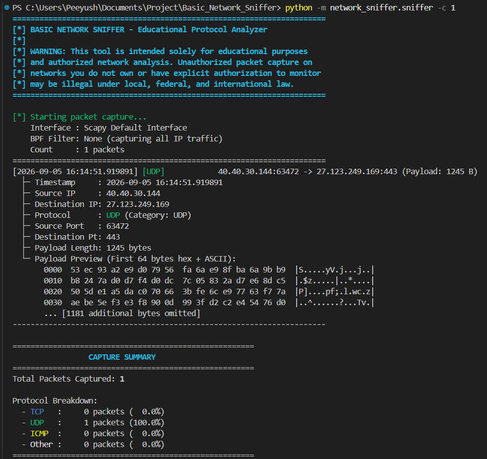
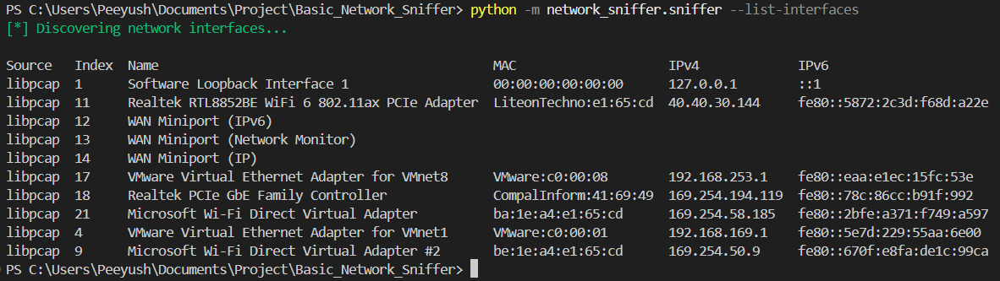
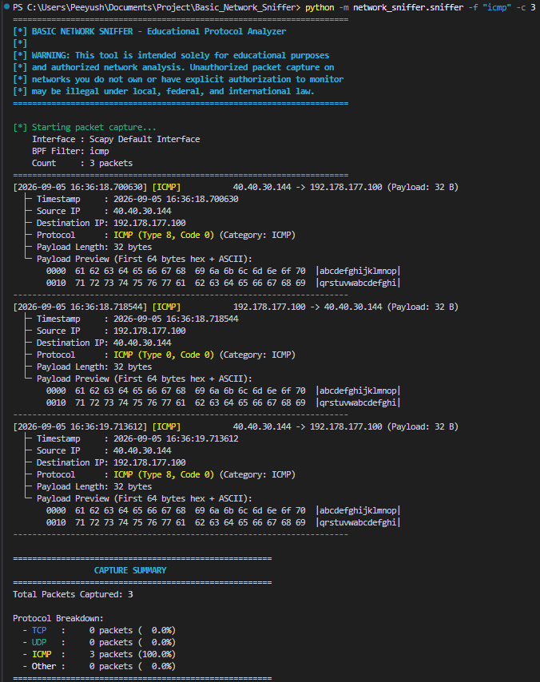
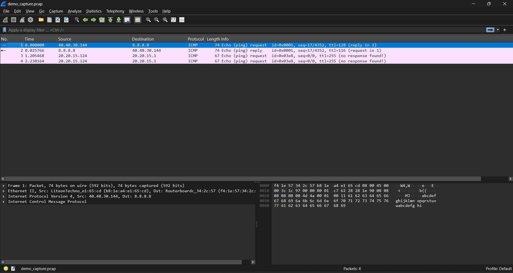
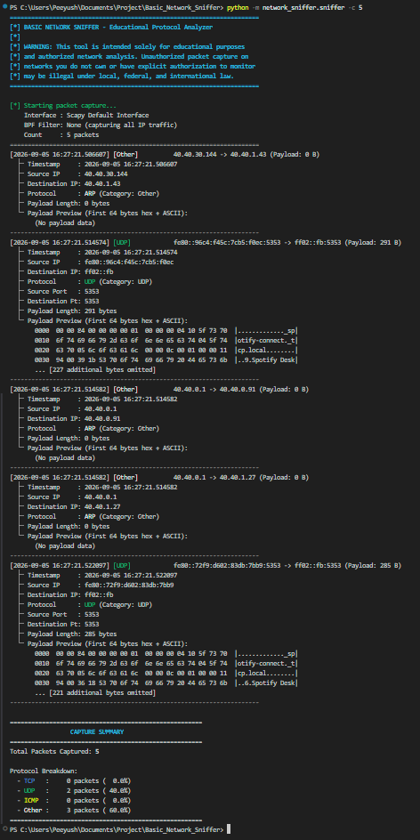
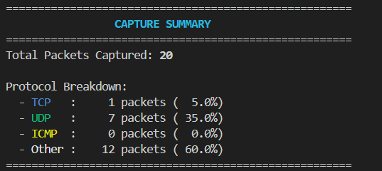
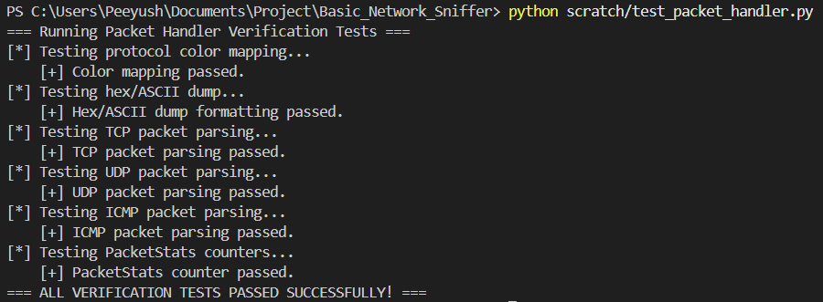

# 🛡️ Basic Network Sniffer CLI

A simple command-line tool that lets you **watch network traffic live** on your own computer — built with Python and Scapy.

Think of it like a mini, text-based version of Wireshark. It shows you where your computer's data is going, what protocol it's using (TCP, UDP, ICMP), and even lets you peek at the raw bytes being sent.

This project is built for **learning** — to understand how networks and protocols actually work under the hood. It's intentionally kept simple: no GUI, no database, no complicated setup. Just one script you run in a terminal.

Works on both **Windows** and **Linux**.

---

## ⚠️ Please Read Before Using



This tool captures real network traffic. Only use it on:
- Your own computer/network, or
- A network where you have clear permission to monitor traffic.

Capturing traffic on networks you don't own or don't have permission for is illegal in most countries. This tool is for learning, not for spying on others.

---

## 🎯 What You'll Learn

By using this tool, you'll get hands-on experience with:
- How network packets are structured (headers, ports, flags)
- The difference between TCP, UDP, and ICMP traffic
- How data (payloads) actually looks in raw hex/ASCII form
- How tools like Wireshark work behind the scenes

---

## 📁 What's Inside This Project
Basic_Network_Sniffer/
├── network_sniffer/
│ ├── sniffer.py → Run this file to start capturing
│ └── packet_handler.py → Handles reading/decoding each packet
├── scratch/
│ └── test_packet_handler.py → Checks everything works (no admin needed)
├── requirements.txt → List of things to install (just 2 packages)
└── README.md → You're reading it!

> 💡 You might see a `__pycache__` folder appear after running the script — that's just Python's auto-generated cache. Totally normal, safe to ignore or delete.

---

## 🚀 Getting Started

### Step 1: Make sure Python is installed
You need **Python 3.8 or newer**. Check with:
```bash
python --version
```
If you don't have it, download it from [python.org](https://www.python.org/downloads/).

### Step 2: Get the project files
```bash
cd Basic_Network_Sniffer
```

### Step 3: Install the required packages
Run this on **both** Windows and Linux:
```bash
pip install -r requirements.txt
```
This installs just two lightweight tools:
- `scapy` — does the actual packet capturing
- `colorama` — adds color to the terminal output
---
### Step 4: Check your available network interfaces (optional)
Before capturing, you can see what interfaces are available on your machine:
```bash
python -m network_sniffer.sniffer --list-interfaces
```



## 🪟 Extra Setup for Windows Users

Windows needs one extra thing installed before packet capture will work: **Npcap** (a driver that lets programs read network traffic).

1. Download Npcap here: [https://npcap.com/#download](https://npcap.com/#download)
2. Run the installer.
3. ✅ **Important**: During installation, check the box that says **"Install Npcap in WinPcap API-Compatible Mode"**.
4. Open your terminal (Command Prompt or PowerShell) **as Administrator**:
   - Right-click the terminal icon → "Run as administrator"

That's it — you're ready to run the tool.

---

## 🐧 Extra Setup for Linux Users

Linux needs elevated permission to read raw network traffic. You have two options:

**Option A — Just use `sudo` every time (easiest):**
```bash
sudo python3 -m network_sniffer.sniffer
```

**Option B — Give Python permanent permission (no sudo needed each time):**
```bash
sudo setcap cap_net_raw+eip $(readlink -f $(which python3))
```
> Note: If you're using a virtual environment (`venv`), you'll need to re-run this command any time you create a new one.

---

## ▶️ How to Run It

### See what network interfaces are available
```bash
python -m network_sniffer.sniffer --list-interfaces
```

### Start capturing (runs until you press Ctrl+C)
```bash
python -m network_sniffer.sniffer
```
*(Linux users: add `sudo` in front, like `sudo python -m network_sniffer.sniffer`)*

### Capture only a specific number of packets
```bash
python -m network_sniffer.sniffer -c 10
```
Stops automatically after 10 packets.

### Capture only certain traffic (using filters)
```bash
python -m network_sniffer.sniffer -f "tcp port 80"     # only website traffic
python -m network_sniffer.sniffer -f "icmp"             # only ping traffic


python -m network_sniffer.sniffer -f "udp port 53"      # only DNS traffic
```

### Save your capture to a file (viewable in Wireshark)
```bash
python -m network_sniffer.sniffer -c 25 -o my_capture.pcap
```


### Pick a specific network interface
```bash
python -m network_sniffer.sniffer -i eth0                              # Linux
python -m network_sniffer.sniffer -i "Wi-Fi"                           # Windows
```

---

## 🎛️ All Available Options

| Option | Short | What it does | Default |
|---|---|---|---|
| `--iface` | `-i` | Choose which network interface to use | Auto-selected |
| `--filter` | `-f` | Only show certain traffic (e.g. `"tcp port 80"`) | Shows everything |
| `--count` | `-c` | Stop after this many packets (must be 0 or higher) | `0` (never stops) |
| `--save` | `-o` | Save capture to a `.pcap` file | Not saved |
| `--list-interfaces` | | Show available interfaces and exit | — |
| `--help` | `-h` | Show help message | — |

---

## 📖 Understanding What You See

Here's what a live capture looks like in action:



Every packet prints like this:

```text
[2026-09-04 17:35:10.123456] [TCP]            192.168.1.50:54321 -> 93.184.216.34:80 [S] (Payload: 24 B)
  ├─ Timestamp     : 2026-09-04 17:35:10.123456
  ├─ Source IP     : 192.168.1.50
  ├─ Destination IP: 93.184.216.34
  ├─ Protocol      : TCP (Category: TCP)
  ├─ Source Port   : 54321
  ├─ Destination Pt: 80
  ├─ TCP Flags     : [S] (SYN (Synchronize))
  ├─ Payload Length: 24 bytes
  └─ Payload Preview (First 64 bytes hex + ASCII):
       0000  47 45 54 20 2f 20 48 54  54 50 2f 31 2e 31 0d 0a  |GET / HTTP/1.1..|
       0010  48 6f 73 74 3a 20 65 78                           |Host: ex        |
----------------------------------------------------------------------
```

**What each part means, in plain English:**

- **Timestamp** — exact moment the packet was captured
- **Source IP / Destination IP** — where the data is coming from and going to
- **Protocol** — the "language" being spoken (TCP, UDP, or ICMP)
- **Source Port / Destination Port** — think of these as "doors" on a computer that different apps use (port 80 = websites, port 53 = DNS lookups, etc.)
- **TCP Flags** — signals used to manage a connection:
  - `SYN` = "let's start a connection"
  - `ACK` = "got your message"
  - `FIN` = "let's close the connection"
  - `RST` = "connection reset/aborted"
  - `PSH` = "send this data right away"
  - `URG` = "this data is urgent"
- **Payload** — the actual data being sent, shown in both hex (raw bytes) and readable text side-by-side

---

## ⏹️ Stopping a Capture

Just press **Ctrl+C** at any time. You'll see a summary like this:

```text
^C
=== Capture Summary ===
Total Packets Captured : 142
  TCP  : 98
  UDP  : 40
  ICMP : 3
  Other: 1
========================
```


If you were saving to a `.pcap` file, it will be saved safely before the program exits.

---

## ✅ Testing (Optional)

Want to check everything works without needing admin rights or live traffic? Run:

```bash
python scratch/test_packet_handler.py
```


This runs a quick self-check using fake sample packets and tells you if anything's broken.

---

## 🔧 Troubleshooting

| Problem | Fix |
|---|---|
| "Permission denied" on Linux | Run with `sudo`, or use the `setcap` command above |
| "Access is denied" on Windows | Run your terminal as Administrator |
| Nothing captures on Windows | Make sure Npcap is installed (see setup above) |
| `ModuleNotFoundError: scapy` | Run `pip install -r requirements.txt` |

---

## 🚧 What's Intentionally Not Included

To keep this tool simple and beginner-friendly, we've deliberately left out:
- A graphical interface (GUI)
- Traffic analytics/dashboards
- Deep protocol parsing (DNS, TLS, HTTP/2)
- A full automated test suite with `pytest`

If you outgrow this tool, that's exactly when it's time to explore something like Wireshark!